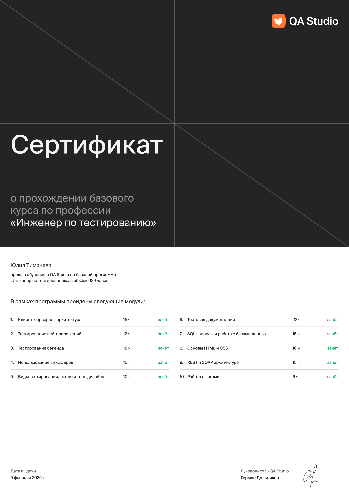
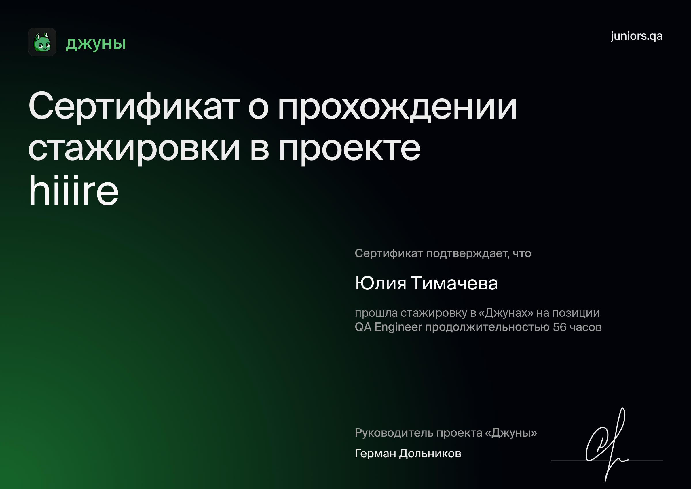
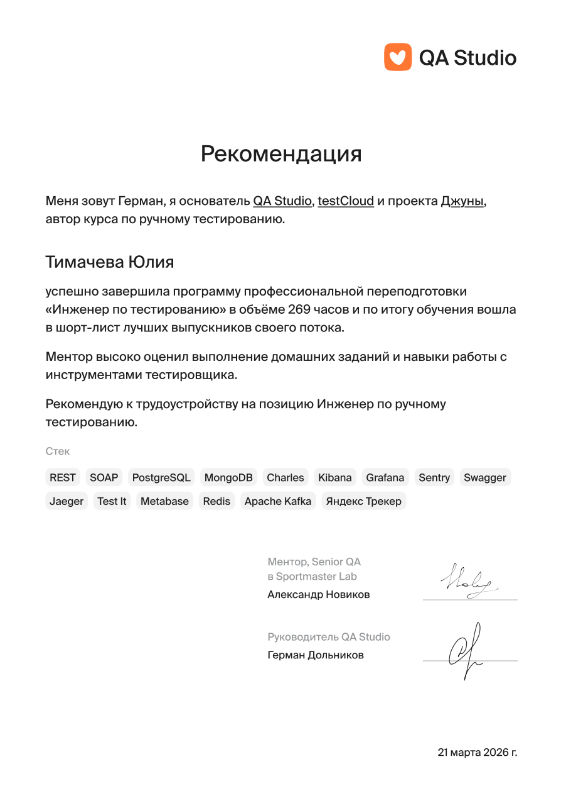

 

**QA Studio · практика в Hiiire · техническое сопровождение образовательной платформы**

 

 &nbsp;&nbsp;&nbsp; 

---

## 🧠 Обо мне в трёх строках

🎯 Работала в QA над HR-сервисом **Hiiire** и сопровождала образовательную платформу

🔍 Умею разбираться в пользовательских обращениях и описывать дефекты понятным языком

📚 Прошла подготовку в **QA.Studio** — чек-листы, баг-репорты, API, SQL, работа с логами

---

### 🧪 Практика

**🟣 QA в HR-сервисе Hiiire** — 56 часов

> Изучение документации и функциональности сервиса · подготовка тестовых данных для проверки парсинга резюме (PDF, DOC, TXT) · ретест и регрессионное тестирование · воспроизведение дефектов по шагам из баг-репортов · заведение и ведение баг-репортов · подготовка рекомендаций по улучшению продукта

**Результаты:**
- 🔁 Провела ретест **29 зарегистрированных дефектов**
- 🐞 Выявила и зарегистрировала **14 новых дефектов**
- ✅ Провела полное **регрессионное тестирование** продукта
- 💡 Подготовила **3 рекомендации** по улучшению продукта
- 📄 Работала с баг-репортами на всех этапах: воспроизведение → проверка исправления → фиксация результата

**🟢 Техническое сопровождение образовательной платформы**

> Настройка и сопровождение учебных курсов · проверка актуальности материалов · поддержка пользователей при регистрации и работе с личным кабинетом · решение проблем с доступом, подтверждением email и Telegram · воспроизведение технических проблем и пользовательских сценариев · описание и передача дефектов в IT-отдел · повторная проверка функционала после исправления

**Кейсы:**
- 🐛 Выявила и передала в IT-отдел дефект: **не приходило письмо для подтверждения email**, что блокировало часть функциональности личного кабинета
- 📱 Обнаружила **ошибку валидации номера телефона** при ручной верификации профиля
- 🗂 **Систематизировала обработку обращений**: воспроизводила ошибки, фиксировала условия возникновения и передавала на исправление

### 🎓 Обучение и подтверждения

<table>
  <tr>
    <td align="center" width="240">
      <a href="certificates/qa-studio-certificate.png">
         
        <b>🎓 QA Studio</b> 
        Сертификат
      </a>
    </td>
    <td align="center" width="240">
      <a href="certificates/hiiire-internship.png">
         
        <b>🏢 Hiiire</b> 
        QA-практика
      </a>
    </td>
    <td align="center" width="240">
      <a href="certificates/qa-studio-recommendation.pdf">
         
        <b>📩 Рекомендация</b> 
        QA Studio
      </a>
    </td>
  </tr>
</table>

---

## 👀 Что умею

| Направление | Что делаю |
|---|---|
| **Тест-дизайн** | Чек-листы, тест-кейсы, баг-репорты с шагами и скриншотами |
| **Веб** | DevTools, HTTP, клиент-серверная архитектура, Charles |
| **API** | Ручные проверки в Postman и Swagger, REST, SOAP, cURL |
| **Данные** | SQL-запросы: SELECT, JOIN, GROUP BY |
| **Логи и мониторинг** | Kibana, Sentry, Grafana |
| **Процессы** | Jira, Confluence, Яндекс Вики, Miro, Git |
| **AI-инструменты** | GPT для анализа, гипотез и рутины |

---

## ⚙️ Инструменты

**API и интеграции**

<table>
  <tr>
    <td align="center" width="100">
       
      <b>Postman</b>
    </td>
    <td align="center" width="100">
       
      <b>Swagger</b>
    </td>
    <td align="center" width="100">
       
      <b>cURL</b>
    </td>
    <td align="center" width="100">
       
      <b>Kafka</b>
    </td>
    <td align="center" width="100">
       
      <b>Docker</b>
    </td>
  </tr>
</table>

**Логи и мониторинг**

<table>
  <tr>
    <td align="center" width="100">
       
      <b>Kibana</b>
    </td>
    <td align="center" width="100">
       
      <b>Sentry</b>
    </td>
    <td align="center" width="100">
       
      <b>Grafana</b>
    </td>
    <td align="center" width="100">
       
      <b>Charles</b>
    </td>
  </tr>
</table>

**Базы данных**

<table>
  <tr>
    <td align="center" width="100">
       
      <b>PostgreSQL</b>
    </td>
    <td align="center" width="100">
       
      <b>MySQL</b>
    </td>
    <td align="center" width="100">
       
      <b>Metabase</b>
    </td>
    <td align="center" width="100">
       
      <b>DBeaver</b>
    </td>
  </tr>
</table>

**Процессы и документация**

<table>
  <tr>
    <td align="center" width="100">
       
      <b>Jira</b>
    </td>
    <td align="center" width="100">
       
      <b>Confluence</b>
    </td>
    <td align="center" width="100">
       
      <b>Miro</b>
    </td>
    <td align="center" width="100">
       
      <b>Git</b>
    </td>
  </tr>
</table>

---

## 💬 Мой подход

> **«Не обязательно знать всё — важно понимать, что именно нужно узнать, где найти информацию и как применить её на практике.»**

Хорошему QA полезно быть **внимательным, любопытным и немного подозрительным** — особенно когда всё работает с первого раза 🙂

---

## 🌱 Вне работы

🎱 Бильярд · 🚶 Прогулки · 🍳 Кулинарные эксперименты

*Последние, как и хороший релиз, иногда требуют повторного тестирования.*

---

**Открыта к:** QA Engineer · удалёнка / гибрид · офис

